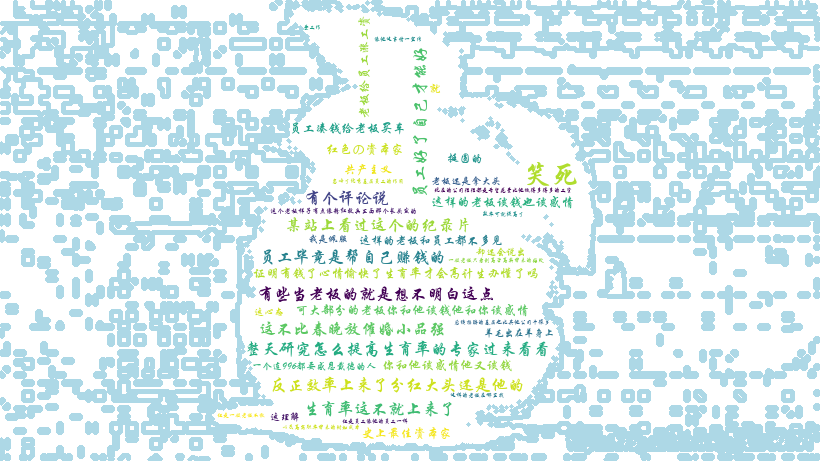

# [Python]爬取新浪微博评论生成词云图

## 前言

前两天没啥事儿翻了翻硬盘，看到了一个本科《网络数据采集》课上做的一个很水但是还蛮有意思的爬虫小Demo，忍不住怀旧一波~

## 实验

### 目的

先通过Python在新浪微博评论区中爬虫数据，将爬取的数据放到txt文件中。然后再进行分词。最终生成词云图。

 [注意]：这里爬取的新浪微博貌似是手机版，是静态的，因此十分容易实现。

### 开发环境

- Python ==  3.6.2
- Pycharm

### 相关模块

- jieba == 0.42.1
- wordcloud == 1.8.2.2
- numpy == 1.19.5
- pillow ==  8.4.0
- 

### 运行结果

`(python36) E:\Lab\词云> python task.py`

```bash
...
Building prefix dict from the default dictionary ...
Loading model from cache C:\Users\Administrator\AppData\Local\Temp\jieba.cache
Loading model cost 0.654 seconds.
Prefix dict has been built successfully.
```



